# 🦷 OdontoApp

> Sistema **desktop, local e offline** para registro de pacientes de uma clínica
> odontológica — atende **adultos** (clínico geral) e **crianças** (odontopediatria).
> Construído com **Tauri + React + Vite**, seguindo o [planejamento](PLANEJAMENTO.md)
> e as interfaces desenhadas no Google Stitch.

<p align="left">
  
  
  
  
  
  
</p>

> **⚠️ Esta versão usa dados _mock_.** Toda a interface e a lógica de negócio estão
> implementadas e funcionando, mas os dados ficam em `localStorage` (simulando o
> banco local). A camada real de **SQLite + SQLCipher via Rust** está desenhada no
> planejamento e é o próximo passo — veja [Roadmap](#-roadmap--etapas).

---

## ✨ Destaques

- 🎨 **Design acessível** para uma usuária de idade mais avançada: fontes grandes,
  alto contraste, botões grandes, rótulos claros e confirmações visíveis.
- 👩‍⚕️👶 **Dois tipos de ficha** — Adulto e Criança — selecionáveis no cadastro e
  trocáveis a qualquer momento.
- 📝 **Nenhum campo é obrigatório** — o botão _Salvar_ sempre funciona.
- 🔐 **Fluxo de senha + chave de recuperação** com a tela dedicada que só fecha no “X”.
- 💰 **Tabela financeira** com saldo calculado automaticamente (adicionar/editar linhas).
- 📄 **Exportação em DOCX** da ficha do paciente (abre no Word, salva como PDF).
- 🗑️ **Exclusão segura** com tela de confirmação + contagem de 5 segundos.
- 💾 **Backup** manual + automático (ao fechar) — mock.

---

## 🖼️ A interface (implementada em React)

Todas as imagens abaixo são **capturas do app React rodando** (não são os mockups).

### Abertura e segurança

| Login | Primeiro acesso | Chave de recuperação |
|:---:|:---:|:---:|
| 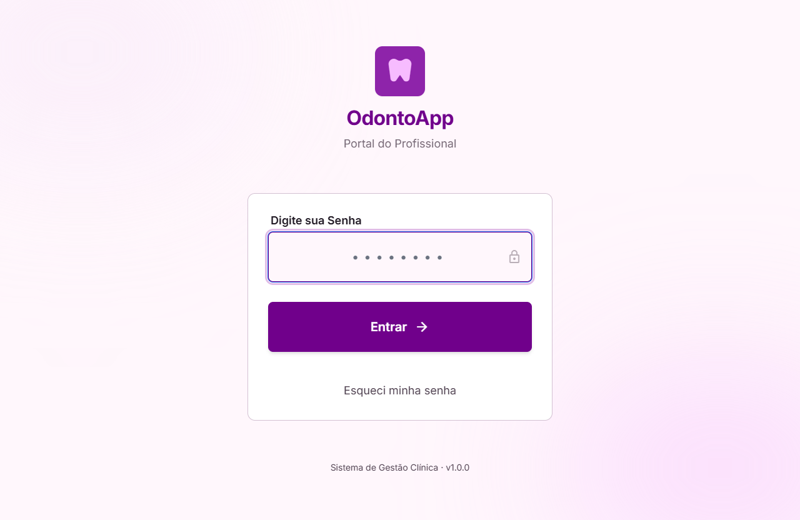 | 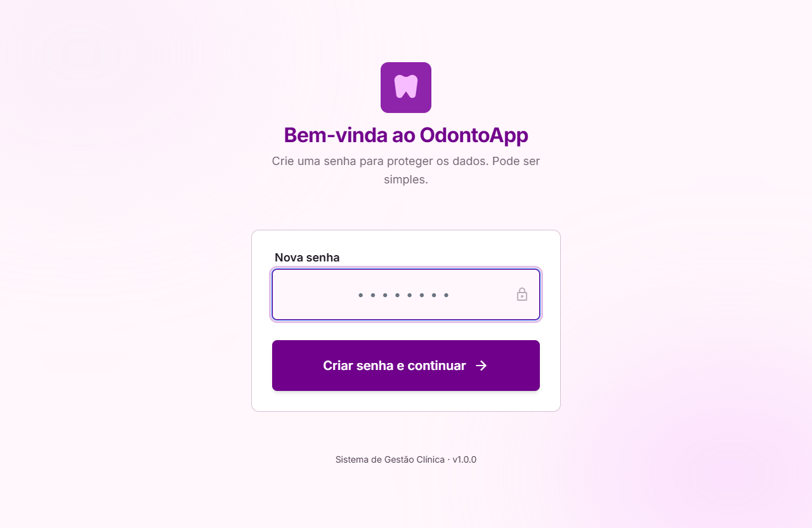 | 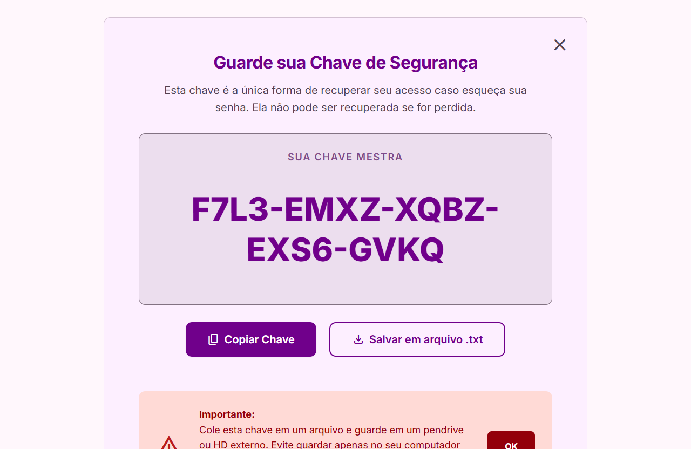 |

### Pacientes

| Lista de pacientes | Novo paciente (tipo) |
|:---:|:---:|
| 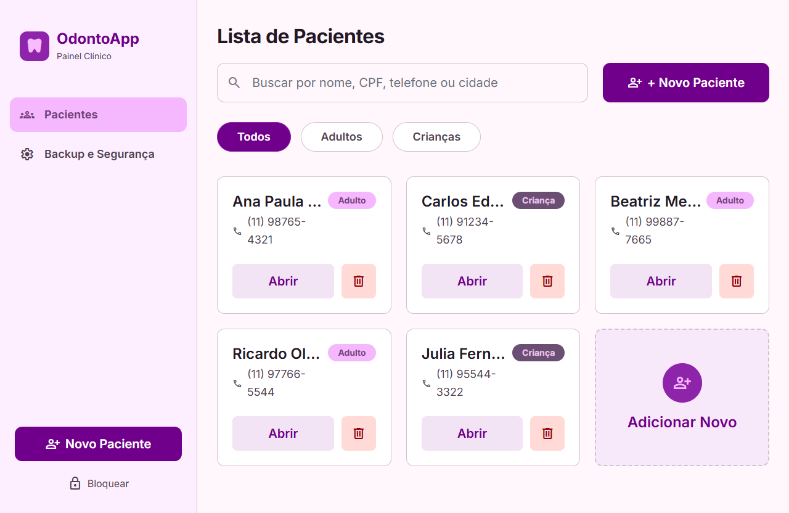 | 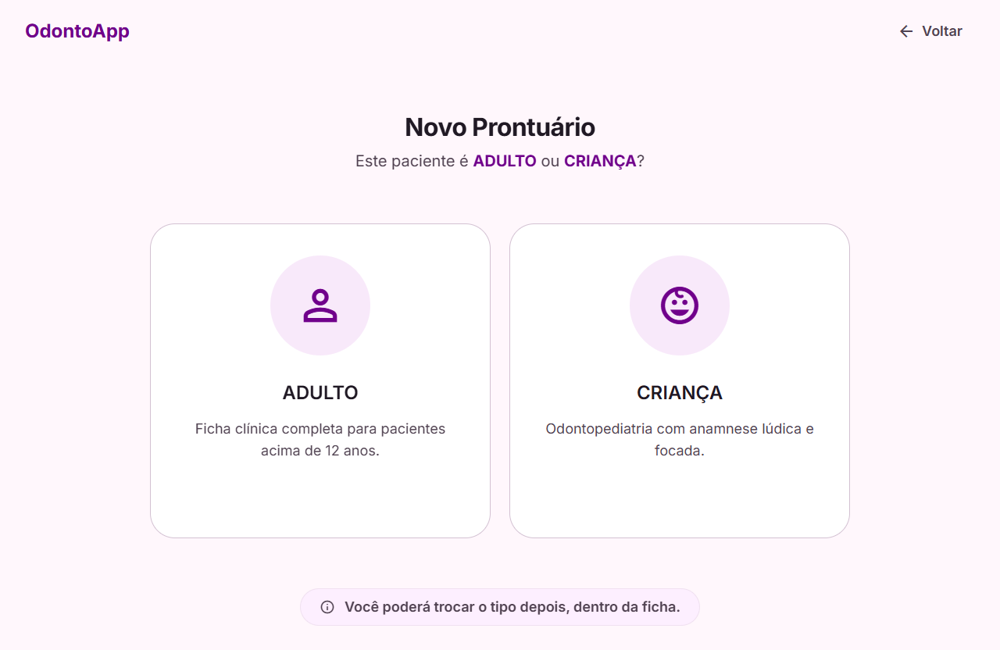 |

### Ficha do Adulto

| Dados pessoais | Anamnese | Plano + Financeiro |
|:---:|:---:|:---:|
| 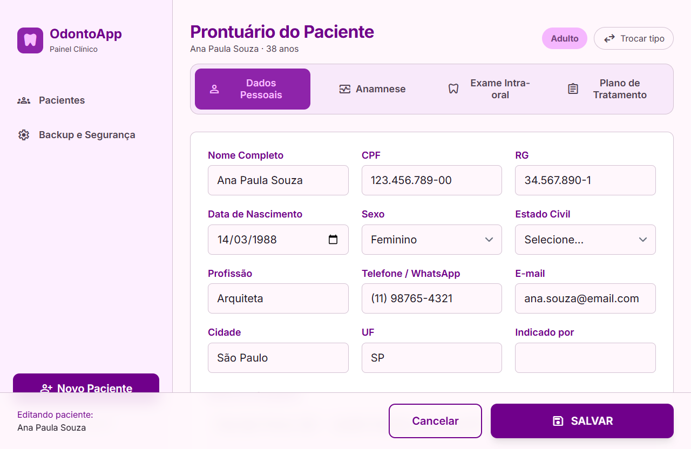 | 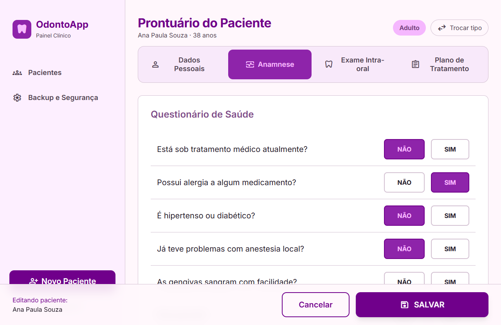 | 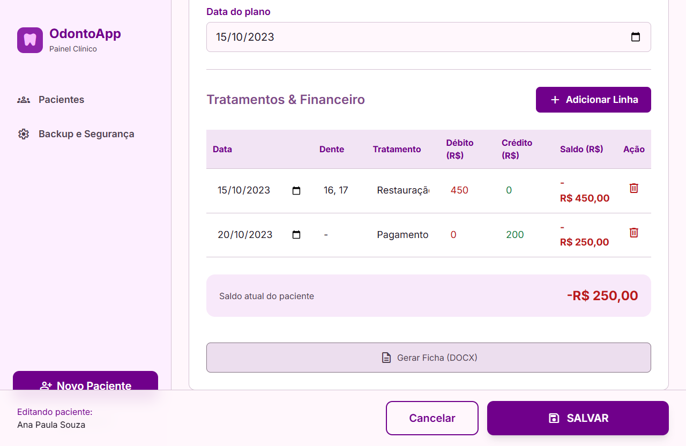 |

### Ficha da Criança (Odontopediatria)

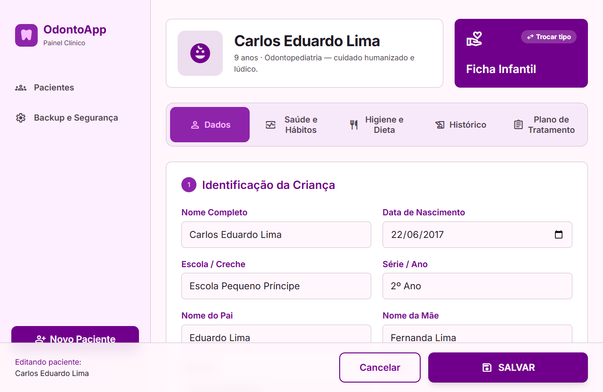

### Exclusão segura e Backup

| Confirmar exclusão (contagem de 5s) | Backup e Segurança |
|:---:|:---:|
| 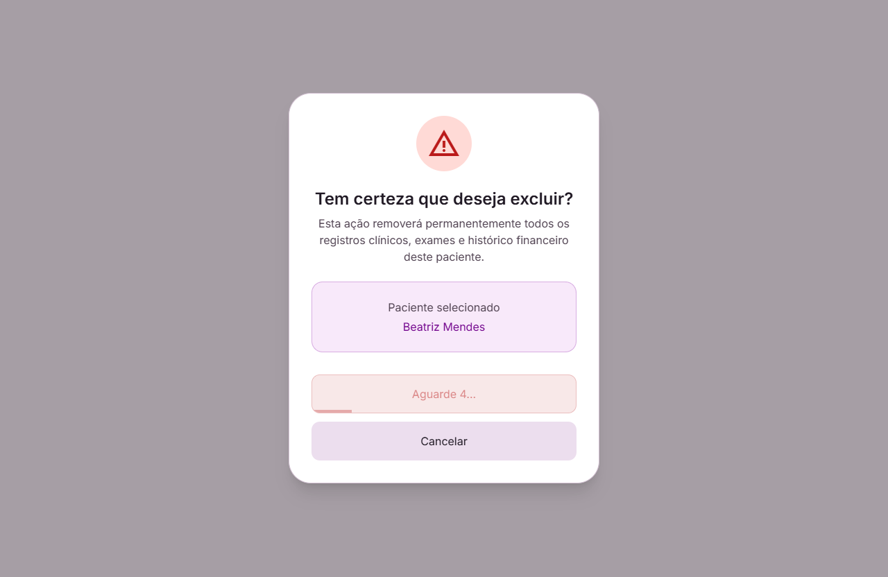 | 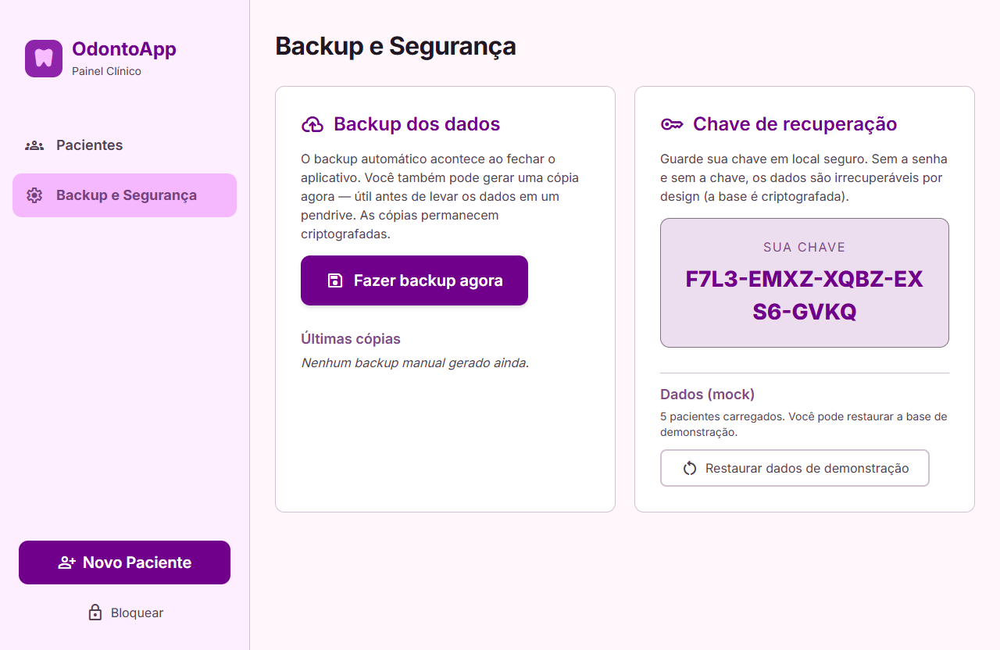 |

---

## 🧱 Stack e arquitetura

| Camada | Tecnologia |
|---|---|
| Shell desktop | **Tauri 2** (instalador leve, WebView2 embutido no Windows) |
| Frontend | **React 19 + Vite 7 + TypeScript** |
| Estilo | **Tailwind CSS 3** com os tokens do design *Serene Clinical Interface* |
| Estado / "banco" | **Zustand** + `localStorage` (mock; futuro: SQLite/SQLCipher via Rust) |
| Roteamento | **React Router** (HashRouter, compatível com o webview) |
| Exportação | **docx** (gera `.docx` no cliente) |

```
┌─────────────────────────────────────────────┐
│  React + Vite (UI, formulários, busca)      │
│        ↕  (hoje) Zustand + localStorage      │
│        ↕  (futuro) Tauri commands → Rust     │
│  Rust (camada fina)                          │
│    • abre o SQLite com SQLCipher (senha)     │  ← previsto (Etapa 1 do plano)
│    • executa as queries / migrations         │
│  SQLite criptografado (.db)                  │
└─────────────────────────────────────────────┘
```

---

## 🚀 Como rodar

Pré-requisitos: **Node 18+**, **Rust** (para o app desktop) e, no Windows, o **WebView2**.

```bash
# instalar dependências
npm install

# 1) Só o frontend no navegador (rápido, ideal para desenvolver a UI)
npm run dev            # abre em http://localhost:1420

# 2) O app desktop completo (janela nativa via Tauri)
npm run tauri dev

# build de produção
npm run build          # frontend
npm run tauri build    # instalador desktop (.msi / .exe)
```

> As imagens deste README são geradas por `node scripts/screenshots.mjs`
> (dirige o app real no Chrome via `puppeteer-core`) com o dev server no ar.

---

## 🗂️ Estrutura do projeto

```
OdontoApp/
├── src/
│   ├── data/          # types, dados mock (seed), stores (Zustand)
│   ├── lib/           # formatação, cálculo de saldo, exportação DOCX
│   ├── components/    # Layout, Icon, Toast, controles de formulário
│   ├── pages/         # Login, ChaveRecuperação, Lista, Fichas, Exclusão, Config
│   ├── App.tsx        # rotas + proteção de acesso
│   └── main.tsx
├── src-tauri/         # shell Rust/Tauri (janela, empacotamento)
├── docs/images/       # capturas da interface (usadas no README)
├── scripts/           # geração das capturas
├── stitch_.../        # mockups originais do Google Stitch (referência)
└── PLANEJAMENTO.md    # documento de planejamento (v3)
```

---

## 🧭 Roadmap / Etapas

Mapeamento das etapas do [planejamento](PLANEJAMENTO.md) para esta entrega mock:

| Etapa | Descrição | Status nesta versão |
|:---:|---|:---:|
| 0 | Fundação (Tauri + React + Vite) | ✅ |
| 1 | Camada de dados | ✅ *(mock em `localStorage`; SQLCipher/Rust pendente)* |
| 2 | Senha + chave de recuperação | ✅ *(fluxo de UX; cripto real pendente)* |
| 3 | Seletor de tipo + dados pessoais | ✅ |
| 4 | Ficha do adulto (anamnese + exame) | ✅ |
| 5 | Plano + tratamentos/financeiro (saldo) | ✅ |
| 6 | Busca, filtros e exclusão (5s) | ✅ |
| 7 | Exportação DOCX (adulto) | ✅ |
| 8 | Ficha da criança | ✅ |
| 9 | Exportação DOCX (criança) | ✅ |
| 10 | Backup + polimento | ✅ *(backup mock)* |
| 11 | Empacotamento e instalação | ⚙️ *configurado; falta gerar/testar o instalador* |

**Próximos passos reais:** substituir a camada mock pela persistência criptografada
(SQLite + SQLCipher via Rust), backup em arquivo real e geração do instalador Windows.

---

## 🔒 Sobre segurança (leia)

Nesta versão _mock_, a senha e a chave de recuperação **não** criptografam nada de
verdade — servem para demonstrar o **fluxo de uso**. Não guarde dados reais de
pacientes aqui até a camada de criptografia (SQLCipher) estar implementada.
Dados de saúde são sensíveis (LGPD).

---

## 📄 Licença

Projeto pessoal / portfólio. Nome **OdontoApp** genérico de propósito.
