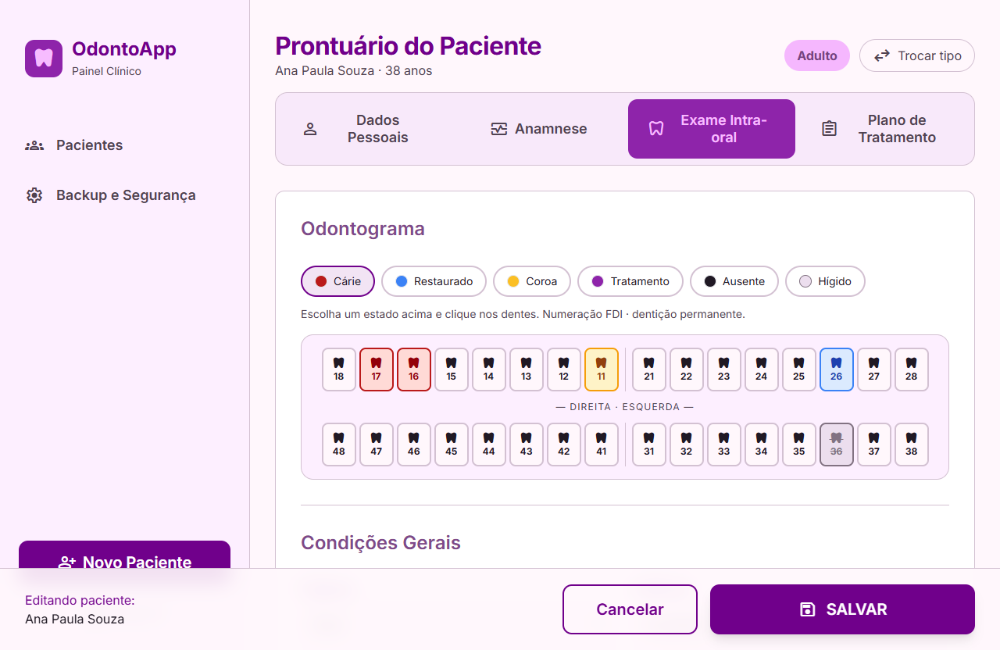

# 🦷 OdontoApp

> Sistema **desktop, local e offline** para registro de pacientes de uma clínica
> odontológica — atende **adultos** (clínico geral) e **crianças** (odontopediatria).
> Construído com **Tauri + React + Vite**, seguindo o [planejamento](PLANEJAMENTO.md)
> e as interfaces desenhadas no Google Stitch.

<p align="left">
  
  
  
  
  
  
</p>

O app roda em **dois modos**, com a mesma interface:

- 🖥️ **App desktop (Tauri):** os dados ficam num **SQLite local com os registros
  criptografados** (chave-mestra protegida pela senha _e_ pela chave de recuperação).
- 🌐 **Navegador (dev/preview):** usa um _mock_ em `localStorage`, para desenvolver a
  UI e gerar as imagens deste README sem precisar compilar o Rust.

A escolha é automática — o mesmo código chama o backend Rust quando está dentro do Tauri.

---

## ✨ Destaques

- 🎨 **Design acessível** para uma usuária de idade mais avançada: fontes grandes,
  alto contraste, botões grandes, rótulos claros e confirmações visíveis.
- 👩‍⚕️👶 **Dois tipos de ficha** — Adulto e Criança — selecionáveis no cadastro e
  trocáveis a qualquer momento.
- 📝 **Nenhum campo é obrigatório** — o botão _Salvar_ sempre funciona (validação só
  suave: um aviso discreto para CPF/e-mail estranhos, sem bloquear).
- 🔐 **Segurança real:** senha + chave de recuperação "embrulham" uma chave-mestra
  aleatória (Argon2id + XChaCha20-Poly1305); os registros são cifrados em disco.
- 🦷 **Odontograma** clínico (dentição permanente e decídua, numeração FDI).
- 💰 **Tabela financeira** com saldo calculado automaticamente (adicionar/editar linhas).
- 📄 **Exportação em DOCX** da ficha do paciente (abre no Word, salva como PDF).
- 🗑️ **Exclusão segura** com tela de confirmação + contagem de 5 segundos.
- 💾 **Backup** manual + automático ao fechar (copia o `.db` cifrado).

---

## 🖼️ A interface (implementada em React)

Todas as imagens abaixo são **capturas do app React rodando** (não são os mockups).

### Abertura e segurança

| Login | Primeiro acesso (senha + confirmação) | Chave de recuperação |
|:---:|:---:|:---:|
|  |  |  |

### Pacientes

| Lista de pacientes | Novo paciente (tipo) |
|:---:|:---:|
|  |  |

### Ficha do Adulto

| Dados pessoais | Anamnese | Odontograma | Plano + Financeiro |
|:---:|:---:|:---:|:---:|
|  |  |  |  |

### Ficha da Criança (Odontopediatria)


### Exclusão segura e Backup

| Confirmar exclusão (contagem de 5s) | Backup e Segurança |
|:---:|:---:|
|  |  |

---

## 🧱 Stack e arquitetura

| Camada | Tecnologia |
|---|---|
| Shell desktop | **Tauri 2** (instalador leve, WebView2 embutido no Windows) |
| Frontend | **React 19 + Vite 7 + TypeScript** |
| Estilo | **Tailwind CSS 3** com os tokens do design *Serene Clinical Interface* |
| Backend seguro | **Rust** — `rusqlite` (SQLite `bundled`) + `argon2` + `chacha20poly1305` |
| Estado (UI) | **Zustand** (cópia em memória com _write-through_ para o backend) |
| Roteamento | **React Router** (HashRouter, compatível com o webview) |
| Exportação | **docx** (gera `.docx` no cliente) |

```
┌─────────────────────────────────────────────┐
│  React + Vite (UI, formulários, busca)      │
│        ↕  backend.ts (escolhe automático)   │
│   ┌──────────────┴───────────────┐          │
│   ▼ Tauri (invoke)               ▼ navegador │
│  Rust (camada segura)          localStorage  │
│   • Argon2id deriva a chave       (mock/dev) │
│   • XChaCha20-Poly1305 cifra                 │
│   • rusqlite grava no SQLite                 │
│   • backup do arquivo .db                    │
│  SQLite local (registros cifrados)           │
└─────────────────────────────────────────────┘
```

### 🔐 Como funciona a criptografia (§3 do plano)

1. No primeiro uso é gerada uma **chave-mestra** aleatória (32 bytes).
2. Ela é guardada **embrulhada duas vezes** em `keys.json`: uma cópia cifrada com uma
   chave derivada da **senha** (Argon2id), outra com uma chave derivada da **chave de
   recuperação**. Trocar a senha só re-embrulha a cópia da senha — não recifra os dados.
3. Cada registro de paciente é cifrado com **XChaCha20-Poly1305** usando a chave-mestra
   antes de ir para o SQLite. No banco, os dados **não** ficam em texto puro.
4. Sem a senha **e** sem a chave de recuperação, os dados são irrecuperáveis — por design.

> **Nota sobre SQLCipher:** o plano previa SQLCipher (cifra o arquivo inteiro), mas ele
> exige compilar OpenSSL (perl/nasm) e não compila em qualquer ambiente Windows. Optou-se
> por criptografia **100% Rust** dos registros, com o **mesmo modelo de segurança de duas
> credenciais** do plano. Migrar para SQLCipher no futuro é trocar a _feature_ do
> `rusqlite` e definir `PRAGMA key` ao abrir a conexão (ver comentários em `src-tauri/src`).

O backend tem teste automatizado do ciclo completo (`cargo test` em `src-tauri`):
criação, senha certa/errada, _round-trip_ cifrado, recuperação e backup.

---

## 🚀 Como rodar

Pré-requisitos: **Node 18+**, **Rust** (para o app desktop) e, no Windows, o **WebView2**.

```bash
# instalar dependências
npm install

# 1) Só o frontend no navegador (rápido, UI em modo mock)
npm run dev            # abre em http://localhost:1420

# 2) O app desktop completo (janela nativa + backend Rust criptografado)
npm run tauri dev

# testes do backend Rust
cd src-tauri && cargo test

# build de produção
npm run build          # frontend
npm run tauri build    # instalador desktop (.msi / .exe)
```

> As imagens deste README são geradas por `node scripts/screenshots.mjs`
> (dirige o app real no Chrome via `puppeteer-core`) com o dev server no ar.

---

## 🗂️ Estrutura do projeto

```
OdontoApp/
├── src/
│   ├── data/          # types, dados mock (seed), backend (Tauri↔mock), stores
│   ├── lib/           # formatação, saldo, validação suave, exportação DOCX
│   ├── components/    # Layout, Icon, Toast, Odontograma, controles de formulário
│   ├── pages/         # Login, ChaveRecuperação, Lista, Fichas, Exclusão, Config
│   ├── App.tsx        # rotas + proteção de acesso
│   └── main.tsx
├── src-tauri/
│   └── src/
│       ├── store.rs   # criptografia (Argon2 + XChaCha20-Poly1305) + SQLite + backup
│       └── lib.rs     # comandos Tauri + backup automático ao fechar
├── docs/images/       # capturas da interface (usadas no README)
├── scripts/           # geração das capturas
├── stitch_.../        # mockups originais do Google Stitch (referência)
└── PLANEJAMENTO.md    # documento de planejamento (v3)
```

---

## 🧭 Roadmap / Etapas

Mapeamento das etapas do [planejamento](PLANEJAMENTO.md):

| Etapa | Descrição | Status |
|:---:|---|:---:|
| 0 | Fundação (Tauri + React + Vite) | ✅ |
| 1 | Camada de dados | ✅ *(SQLite via Rust; mock no navegador)* |
| 2 | Senha + chave de recuperação | ✅ *(criptografia real de duas credenciais)* |
| 3 | Seletor de tipo + dados pessoais | ✅ |
| 4 | Ficha do adulto (anamnese + exame + odontograma) | ✅ |
| 5 | Plano + tratamentos/financeiro (saldo) | ✅ |
| 6 | Busca, filtros e exclusão (5s) | ✅ |
| 7 | Exportação DOCX (adulto) | ✅ |
| 8 | Ficha da criança + odontograma decíduo | ✅ |
| 9 | Exportação DOCX (criança) | ✅ |
| 10 | Backup (manual + automático ao fechar) | ✅ |
| 11 | Empacotamento e instalação | ⚙️ *configurado; falta gerar/testar o instalador no Win 10* |

**Pendências conhecidas (fora do escopo atual):** gerar e testar o instalador `.msi/.exe`
num Windows 10 limpo; e os itens marcados como "futuro" no plano (lixeira recuperável,
PDF nativo, campos obrigatórios opcionais, política LGPD).

---

## 🔒 Segurança e responsabilidade

Os registros são cifrados em disco, mas lembre-se: **perder a senha e a chave de
recuperação torna os dados irrecuperáveis** (é intencional). Dados de saúde são
sensíveis (LGPD) — faça backups e guarde a chave em local seguro (pendrive/HD externo).

---

## 📄 Licença

Projeto pessoal / portfólio. Nome **OdontoApp** genérico de propósito.
